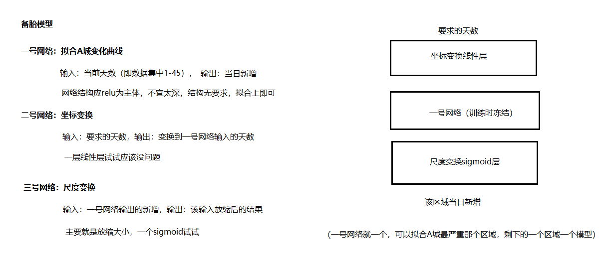

疫情预测备胎模型
===========
原理
---------
该模型基于坐标变换。基本假设是：不同地区的整个疫情进程整体形态相似，只是曲线的高低长短形态有所不同。所以我们通过一个已经经历整个疫情进程地区的曲线，进行坐标映射和尺度放缩得到其它地区的曲线。

形式化表示即为，设已知完整进程曲线`f(x)`（下称基准函数），引入坐标变换函数`g`和尺度变换函数`h`，得新曲线`h(f(g(x')))`，`x'`为新地区的自变量（我们的例子中为天数）。

当前基准函数已知，需要求`g`与`h`的参数。这里我们使用反向传播算法[1]，希望基准函数以最小的变换代价贴合所求地区的已知曲线，这个变换通过`g`与`h`完成，达成最小代价即代表着二者取到最优参数。这样，在所得曲线贴合当前地区已知曲线的同时，通过基准函数提供的先验形态，该地区样本外的曲线值也可以得到估计。

实施
----------
因为要使用反向传播算法，所以必须得到`f`、`g`与`h`三者可微的表示。`f(x)`可以通过任意函数拟合的方式求得，三次样条插值[2]是我们推荐的手段。`g`与`h`因为需要在反向传播的过程中调整，因此这里我们使用两个简单的神经网络模型来表示。为了方便编程，基准函数也就直接使用神经网络拟合得到。如果你使用其它插值方法求得基准函数的解析式，那么可以使用keras的自定义层来替换我们例子中表示基准函数的网络。

我们的例子模型示意图如下：

需要注意的是`g`与`h`的函数原型。`h`表示对基准函数的尺度变换，因此需要控制其表达能力，我们使用了简单的单线性层。如果将`h`设计的过于复杂，反向传播过程将直接通过`h`函数拟合当前地区的形态，而不是试图对基准函数进行变换（因为这相比直接调整`h`代价更大）。`g`的原型取决于你所期待的坐标变换形式，在我们的例子是一个简单的`时间-人数`的一维函数，那么从x轴来说，我只希望它进行左右平移和放缩，即一维仿射变换。所以在设计中只尝试使用数个带偏置的线性层组合（在后来因为效果不理想，克制地更换了一些relu）。如果觉得你所要达到的效果有必要使用更复杂的映射函数，那么可以酌情进行修改。不过值得庆幸的是，即使`g`相对较深也不会像`h`那样对结果直接造成严重影响，因为`g`只决定了`f`的自变量，最终的曲线值还是由`f`计算得到。

针对高维问题的分析
-----------------
我们的例子只针对了一维函数，那么在高维情况下这个方法还能否适用呢？如添加多个与传染病相关的时序变量时？首先，坐标和尺度变换在高维情况下当然适用，但需要注意的是，二者都是针对高维图形整体。如果你的指标仅关注这个高维函数的某个截面（如添加时序变量时），那么该模型将无法直接套用。

举个例子，假设你希望研究`x`、`y`坐标与函数值的关系（即感染人数随区域的变化，假设二者有函数关系），并希望对样本外的`x`、`y`区间的函数值进行预测，那么你将会关注的是基准函数`f(x,y)`所描述的三维图形整体。在这种情况下，坐标变换和尺度变换依然能有很好的表现，模型也可以使用。但假如你要引入医疗资源（随时间变化）作为外生变量，希望使用二者对未来的感染人数进行预测，这将无法得到好的结果。

这是为什么呢？
* 在第一种情况下，假设`30×30`网格内的`x`、`y`值已知，那么我们将通过900个数据来了解整个区间的分布。
* 第二种情况，医疗资源作为一个时序变量依附于时间的，即在引入后，数据数量并没有改变（还是30个）——因为我们只关心在医疗资源这个变量取值正确的情况下，该时间的预测值，而不是希望知道这个时间各种医疗资源情况下的预测值，即关注的仅仅是用一条`y=g(x)`（表示医疗资源随时间变化）的曲面截基准函数`f(x,y)`得到的截面高，而不是基准函数整体

虽然当我们知道`f(x,y)`整体的分布时，当然可以知道其任意一个截面的信息。但我们所拥有的数据全部都在一个截面上（30个）而不是均匀分布在整个二维区间内（900个），自然就没有足够的信息对整个基准函数进行建模。既然无法保证基准函数的准确性，坐标变换与尺度变换也就失去了意义。

引入时序变量的可能方案
--------
如果需要引入时序变量，怎样对这个模型进行改进呢？

首先，我们认为，其它时序变量带来的影响即为当它们取不同值时曲线会展现出不同的形态，通过我们对疫情数据的分析，曲线具有几种典型形态，大部分地区的疫情进程都可以落在这几种形态之内。

因此我们考虑的方案是，分离时间变量与其它时序变量。首先通过已知的时序变量对数据进行分类，判断其对应哪种形态，之后再使用对应形态的模型采取上面所说的方案进行训练和预测。这样可以将**多维回归**问题转化成**小规模的分类**和**简单回归**，有效利用已知信息，提高训练的稳定性。

总结
-----
### 适用对象
* 自相关序列预测

### 我们的优势
* 类One-shot Learning[3]，高效利用已知信息
* 具有理论解释的训练稳定性
* 对复杂问题进行分解转化
* （相比微分模型[4]）更好利用掌握的时序数据

### 我们的缺陷
* 非常依赖基准函数。尤其在引入其它时序变量情况下，如果基准函数选择错误无法正确工作

研究人员
-----
一个也不能少
* zmk负责了整个算法的设计与分析
* 周桐负责了整个算法的程序实现、调试与实验工作
* 高进负责尝试实现其它的方案（maybe快有了？）

致谢
-----
感谢铁岭TV，辽宁TV，将来还有可能感谢CCTV，主要还要感谢学校没留太多作业

引用
------
* [1] Rumelhart D E , Hinton G E , Williams R J . Learning Internal Representation by Back-Propagation Errors[J]. Nature, 1986, 323:533-536.
* [2] Boor de,C. Bi-cubic spline interpolation[M]// Interpolating cubic splines /. Birkh user, 1962.
* [3] Vinyals O , Blundell C , Lillicrap T , et al. Matching Networks for One Shot Learning[J]. 2016.
* [4] 陈思行. 几类传染病微分方程模型的传播动力学分析[D]. 桂林电子科技大学 ,2018

程序目录
-----
* `check.py`：画出指定城市所有图像
* `to_submission.py`：整合所有城市的结果为提交表格形式
* `通用版本.py`：基于基准函数微调生成指定城市每个区域的模型
* `通用版本v2.py`：调整`h`与`g`的结构，解决一些因已知数据与基准函数形态不同导致拟合不上的问题（属于基于实践做的改进）
* `一号网络.py`：基于完整进程的数据训练基准函数模型（神经网络）
* `toy_v5_s.h5`：基准函数模型（神经网络）
* `toy_v5_xr.h5`：适合大型地区的基准函数
* `toy_v5_zt.h5`：适合小型地区的基准函数